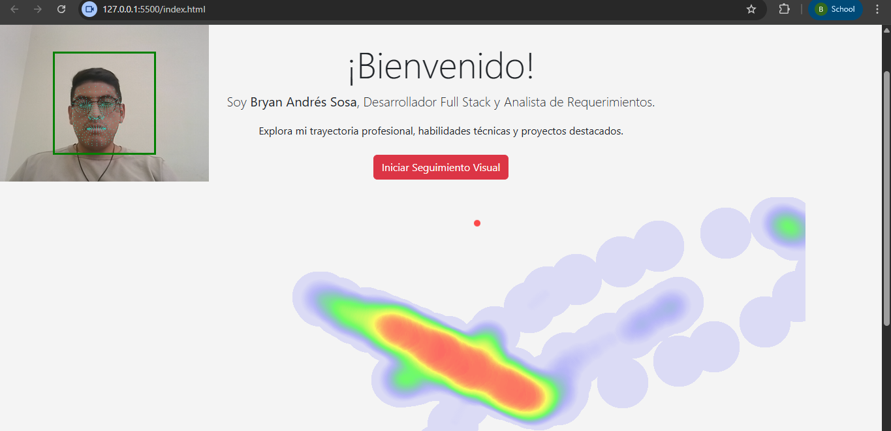

# Seguimiento Visual con WebGazer.js y Heatmap.js

Este proyecto implementa un sistema de seguimiento ocular en una página web, utilizando la cámara del dispositivo para capturar la posición estimada de la mirada del usuario y generar un mapa de calor con las zonas más observadas.

## Autor
**Bryan Andrés Sosa**  
Estudiante de Ingeniería de Software - 7mo semestre  
UISEK

---

## ¿Qué hace el proyecto?

- Utiliza **WebGazer.js** para capturar en tiempo real la mirada del usuario desde la cámara.
- Almacena las coordenadas X, Y de los puntos observados.
- Al presionar un botón, inicia o detiene el seguimiento visual.
- Cuando se detiene, genera un **mapa de calor interactivo** con **Heatmap.js**.
- El mapa permite visualizar las zonas donde el usuario ha enfocado más la vista.

---

## ¿Cómo ejecutarlo?

1. Clona o descarga este repositorio.
2. Abre el proyecto en **Visual Studio Code**.
3. Haz clic derecho sobre `index.html` y selecciona **"Open with Live Server"**.
4. Acepta el permiso de cámara cuando el navegador lo solicite.
5. Presiona el botón **"Iniciar Seguimiento Visual"** y navega visualmente por la página.
6. Luego presiona **"Detener y Mostrar Mapa de Calor"** para ver los resultados.

Es necesario contar con **una cámara web activa** y un navegador moderno como Chrome.

---

## Librerías utilizadas

- [`WebGazer.js`](https://webgazer.cs.brown.edu/) – para seguimiento de la mirada.
- [`Heatmap.js`](https://www.patrick-wied.at/static/heatmapjs/) – para generar el mapa de calor.
- [`Bootstrap 5`](https://getbootstrap.com/) – para diseño responsive y botones.

---

## Captura de pantalla

*Ejemplo de zonas observadas por el usuario.*

---

📁 Proyecto WebGazer Heatmap
├── index.html
├── acerca.html
├── proyectos.html
├── README.md
│
├── 📁 css
│   └── desktop.css
│
├── 📁 js
│   ├── accessibility.js
│   ├── eyetracking.js
│   └── heatmap.min.js
│
├── 📁 img
│   ├── Foto Carnet.png
│   ├── sismed.png
│   ├── sispasantes.png
│   └── captura_heatmap.png
